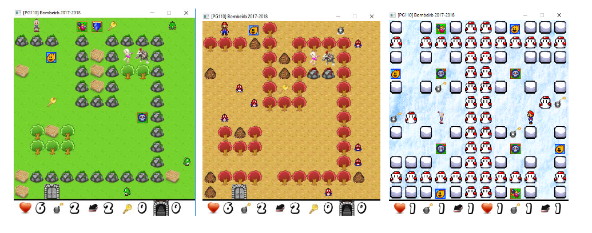
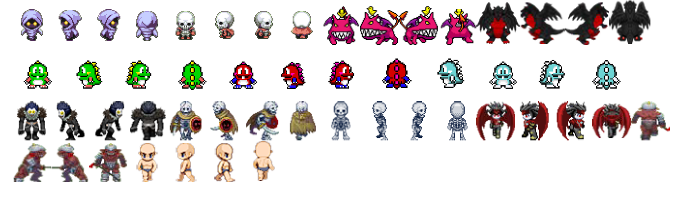
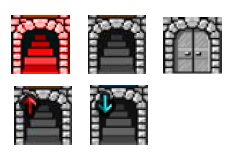
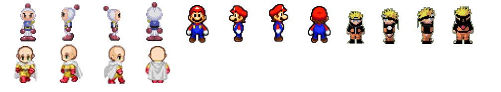
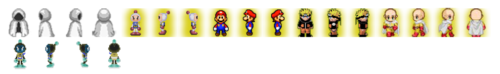
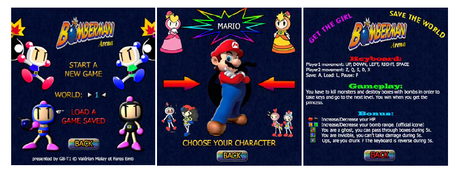
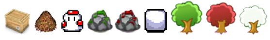

# **RAPPORT BOMBEIRB**

# **PATCH NOTE 1.00.00 :**

## I - Fonctionnalités de base fonctionnalités bonus rajoutées

### Gestion des bombes :

    Bombes sous forme de liste chaînée, l’ajout d’une bombe la met en tête de liste et se passe en appuyant sur [ESPACE].
    Bombe possède 5 états, évoluant grâce a la différence entre le temps et le temps de naissance d’une bombe.
    8 bombes simultanées peuvent être posées. Le joueur ne peut pas avoir moins de 0 bombe. A chaque fin de bombe, le joueur
    reprend sa bombe en main. Les bombes explosent les joueurs, monstres, boxes et bonus.
    Le reste des fonctionnalités indiqué sur le sujet sont inclus dans la gestion des bombes (obstacles, perte vie, tue monstre, ...)
    Chaque bombes possèdent sa propre portée, déterminer au moment où elle est posé.
    Si une bombe explose sur une autre bombe, alors l’autre bombe explose instantanément
    La récupération de la bombe se fait par l’appui de ESPACE et est donc délié de l’évolution de la bombe.
    Chaque bombes possèdent son propre propriétaire. Elle est liée au Player qui l’a posé.

### Gestion des monstres :

    Monstres sous forme de liste chaînée, au début de chaque niveau, la map est parcouru et les monstres sont initialisés.
    Les monstres ont une certaine rapidité qui augmente à chaque niveau en fonction de la difficulté choisi.
    Les monstres ont un certain nombre de HP, initialisé à 1, qui détermine le nombre de coup qu’ils peuvent prendre.
    Le reste des fonctions indiquées sur le sujet sont inclus dans la gestion des monstres (obstacles, perte vie, orientation, move..)
    Les monstres sont doté d’une intelligence artificielle pour les contrôler. Le monstre calcule la distance X et Y le séparant du
    player et essaye de rendre X ou Y minimale. Si en essayant d’y parvenir il rencontre un obstacle, alors il essaye de le contourner
    en essayant d’abord de minimiser l’autre variable, sinon il essaye un mouvement aléatoire.
    Il existent 13 types de monstres, de 40x40, dans les 4 positions pour pouvoir les animer, ils sont coloriés et modifiés à la main :
    

### Gestion des maps :

    En jeu, les maps sont lu de manière unique, c’est-a-dire qu’on ne stock qu’un seul tableau de 12x12 à la fois.
    Les maps originales sont conservé dans les dossier data/worlds et sont lancées la 1ere fois que le joueur visite le niveau.
    Les maps déjà visités et modifiés sont enregistrées au moment du changement de niveau dans un dossier data/temp avec le
    numéro du world et le numéro du niveau de la map. Celle-ci seront alors chargé à la place des originales.
    Les 5 premières maps du world 1 sont imaginées comme un tutoriel pour apprendre au joueur les bases du jeu.
    Création de 30 différentes maps avec des skins différents selon les worlds (worlds détaillés plus bas).
    Création de nouveau sous-type de cellule (monstres, bonus, bombes) pour une meilleure gestion et de nouveaux affichages.

### Gestion des portes :

    Il existe deux portes dans chaque niveau sauf au premier niveau et au dernier niveau.
    La monté ou la descente de niveau se fait en regardant le bits de poid faible d’une porte et le comparant au niveau actuel.
    Les monstres ne peuvent pas aller à plus de deux cases d’une porte.
    Il faut une clef pour ouvrir une porte. Une fois la porte passée, la clef disparait de l’inventaire.
    3 différentes manières d’ouvrir une porte :
    -Lorsqu’un joueur ramasse une clef, la porte s’ouvre automatiquement.
    -Lorsque le joueur est sur une porte ouverte, il peut appuyer sur espace pour changer de niveau.
    -Lorsque le joueur marche sur une porte ouverte, il change directement de niveau.
    Il y a une distinction d’image entre une porte qui monte et une porte qui descend :

### Gestion des joueurs:

    Les mouvements du joueur sont limités par la carte et décors. Les caisses peuvent être déplacées par le joueur si rien ne gêne. -
    Si le joueur atteint 0 de vie, alors la partie se termine. Si le joueur arrive à la princesse, alors la partie est remportée et se fini.
    Le joueur possède tous les attributs demandés : vie, nb bombes, portée, nb clef, une direction et une invulnérabilité de 5s
    après avoir pris des dégâts face aux bombes ou aux monstres.
    Lorsqu’un partie se termine, on retourne automatiquement au menu principal.
    Le joueur clignote durant 3s lorsqu’il perd une vie grâce à un attribut d’état. Il est invulnérable pendant le clignotement.
    Le joueur voit ses attributs modifiés en fonction de la difficulté.
    Le joueur possède différentes apparences. Chaque apparence est composé des 4 directions et représente un univers différent
    des jeux vidéos : Bomberman, Mario, Naruto et Saïtama.

### Sauvegarde, Chargement et pause :

    Les pauses sont fait en rentrant dans une boucle infini empêchant les mouvements et le temps de s’écouler. Les positions et le
    temps des monstres et bombes sont réajustés à la fin de la pause.
    Tous les attributs du player sont sauvegardés dans un fichier : vie, position, portée, nombre de bombe, nombre de clef, skin.
    Tous les attributs de la map actuelle est sauvegardés dans un fichier : position des monstres, des décors, boxes, etc.
    Tous les attributs des bombes sont sauvegardés dans des fichiers : position, état, portée, temps de vie.
    Le chargement des fichiers de sauvegardes (player, map, bombs) permettent de retrouver l’exact instant du jeu sauvegardé.
    Le chargement, la sauvegarde et la pause sont désactivées dans le menu et le mode multiplayer.

### Gestion des bonus :

    Les bonus et malus peuvent être sur la carte ou apparaitre lors de l’explosion d’une caisse
    Les bonus de base sont dans le jeu : portée - / portée +, bomb -/bomb +, vie+. Les skins bonus portée à été modifié :
    De plus des 5 bonus/malus de base, 4 nouveaux bonus/malus ont été crée :
    Malus vie - : Le joueur perd une vie.
    Malus tête de mort : Le joueur est fou et se transforme en négatif, tous ses mouvements sont inversés pendant 5s.
    Bonus fantôme : Permet de transformer le joueur en fantôme pendant 5s lui permettant de traverser les boxes.
    Bonus Invulnérabilité : Le joueur est invulnérable à tout type de dégât pendant 5s.

## PARTIE BONUS: FONCTIONALITÉ TOTALEMENT NOUVELLE.

### System Menu & In Game Menu:

    Menu géré grâce à une variable position_menu, il suffit de changer cette variable pour changer directement l’affichage.
    La map, les monstres, le joueur et les bombes ne sont jamais chargé en arrière plan quand le system menu est affiché.
    5 Choix dans le menu principal : Start Game, Multiplayer, Options, Games Rules, Exit. Permettant, dans l’ordre, d’aller au menu
    solo player, d’aller dans le mode jeu multiplayer, de modifier les options, de lire les règles du jeu, et de quitter le jeu.
    Le menu solo player permet de choisir l’apparence du personnage ou le world souhaité. Il peut également charger une partie.
    Les options permettent de choisir la difficulté que l’on souhaite pour le mode solo player.
    Le menu en jeu apparait avec [ECHAP] et permet de sauvegarder, de charger ou de revenir au menu principal.
    Le menu se souvient des choix fait pas l’utilisateur car celui-ci utilise les structures player et map pour afficher les images.
    Chaque changement d’option dans le menu, chaque choix, chaque permutation d’option est une image différente. Au total il y
    a plus d’une 50en d’image pour le menu créées individuellement et entièrement de la base à partir de Photoshop.

### Modes de difficulté:

    3 Modes de difficulté pour le mode solo joueur : Facile, Moyen, Difficile (Easy, Normal, Hard).
    Le mode Easy :
    -6 vie, 2 bombes, 2 de portée pour le player de base.
    -Les monstres n’ont pas de vitesse croissante en fonction des niveaux, ils restent lent.
    Le mode Normal :
    -3 vie, 1 bombe, 1 de portée pour le player de base
    -Les monstres ont leur vitesse qui augmente linéairement en fonction des niveaux.
    Le mode Hard :
    -1 vie, 1 bombe, 1 de portée pour le player de base.
    -Les montres ont leur vitesse qui augmente quadratiquement en fonction des niveaux.

### Les Worlds :

    Il existe 3 worlds qui se choisissent dans le menu. Le choix du world permet d’avoir accès a des maps et skin différents.
    Chaque world possède son propre dossier data/world_1, data/world_2 et data/world_3 avec à l’intérieur des maps différentes
    pour chaque world.
    Chaque world possède un thème différent, le printemps, l’automne et l’hiver.
    Une image de fond qui change en fonction du world choisi.
    En fonction du world (thème), le fond, les décors, les caisses et les monstres ont une couleur différentes. Par exemple les
    caisses sont transformées en bonhomme de neige pour le thème de l’hiver et en tas de feuille pour l’automne.

### New Record et Timer:

    Comme il n’est pas possible d’avoir sa propre évolution de temps qu’on arrête ou commence, nous avons dû calculer le retard
    introduit par les menus, les pauses, etc.. que l’on additionne puis soustrait au temps finale. Ceci nous donne le temps joué.
    Les pauses in game et le temps passés sur les menus sont donc gérés pour faire le record et le timer.
    Lorsque le menu de victoire est affiché, on affiche également le temps réalisé par le joueur.
    Pour afficher le timer, il faut récupéré les unités, dizaines, centaines et les chiffres après la virgule.
    Si le joueur a battu le record établi (ou s’il n’y a pas encore de record), alors il est indiqué que c’est un record. Sinon on affiche le record à battre. Ceci rajoute un coté compétitif au jeu.

### Le Multiplayer (et un nouveau mode de jeu):

    Nouveau mode de jeu : Battle! Deux joueurs s’affrontent dans une arène en face à face.
    Des nouvelles maps sont faites spécialement pour le mode multiplayer. Celle-ci sont stockées dans world_4.
    Le 1er joueur possède les même raccourcis que le mode solo. Le 2ème joueur doit utiliser ZQSD pour se déplacer et X pour poser
    des bombes. (Attention Q=A et Z=W pour les anglais !)
    Les bombes des deux joueurs sont gérés directement grâce à la position des joueurs et à la variable « owner » des bombes.
    Création variable « multiplayer » dans struct game qui détermine si le mode de jeu est multiplayer ou non. Il faut bien
    distinguer les deux modes de jeu pour pouvoir modifier le gameplay de l’un sans entacher celui de l’autre.
    Score : Les deux joueurs ont une nouvelle variable score qui permet de stocker leur score au moment de la partie
    Un joueur augmente de 1 son score lorsqu’il arrive à tuer le joueur adversaire. Un nouveau menu a été crée pour l’occasion.
    Une nouvelle bannière pour le mode multijoueur à été crée.
    Le gagnant est déterminé après 3 manches en prenant le joueur qui à le plus de point.
    Apparition d’un nouveau personnalisé pour le gagnant, puis on retourne sur le menu principal.
    PS : If you want to make some test, you can go to the world3.

# END
